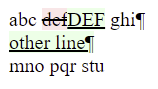

[](https://search.maven.org/artifact/io.github.javiertuya/visual-assert)
[](https://www.nuget.org/packages/VisualAssert/)

# visual-assert

Assertion methods that generate an html file with the differences highlighting the additions and deletions. 
Useful for comparing large strings or files.
Available on Java and .NET platforms.

- From Java include the `visual-assert` dependency as indicated in the 
  [Maven Central Repository](https://search.maven.org/artifact/io.github.javiertuya/visual-assert)
- From .NET include the `VisualAssert` package in you project as indicated in 
  [NuGet](https://www.nuget.org/packages/VisualAssert/)

## Usage

From Java, instantiate the `VisualAssert` class and perform an assert:

```java
VisualAssert va = new VisualAssert();
va.assertEquals("abc def ghi\nmno pqr stu", "abc DEF ghi\nother line\nmno pqr stu");
```

This will produce an html file in the `target` directory that highlights the differences (additions in green, deletions in red):



The assert statement is overloaded to specify an additional message and the name of the differences file if required:

```java
va.assertEquals(String expected, String actual, String message)
va.assertEquals(String expected, String actual, String message, String fileName)
```

From .NET, everything works like Java, only with these differences:

- Method names are capitalized.
- The destination folder is `reports`, located at the level of the project folder.

## Specifying a test framework (java only)

By default, when the assertion fails, a java `AssertionError` is thrown,
which does not require any particular test framework.
If you want also see the diffs from your developement environment, 
you can specify a test framework that will raise the assertion failures:

```java
VisualAssert va = new VisualAssert().setFramework(Framework.JUNIT5);
```

JUnit 3, 4 and 5 are supported. Note that you will get a `NoClassDefFoundError` exception
if the specified framework is not in the classpath.

## Soft assertions

Soft assertions do not throw an exception immediately when an assertion fails, 
but record the assertion message and allow to continue the test and check other assertions.

### Using soft assertions

Class `SoftVisualAssert` implements this type of assertions:
- After a number of calls to `assertEquals()`, calling `assertAll()` will throw the exception 
  if at least one previous assertion failed. The message aggregates the messages of all failed assertions.
- If the soft assert instance is shared by more than one test, `assertClear()` must be called
  before each sequence of assertions to reset the stored messages.
- In addition to `assertEquals` a `fail` assertion is provided.

Example:

```java
SoftVisualAssert va = new SoftVisualAssert();
va.assertEquals("abc def ghi\nmno pqr stu", "abc DEF ghi\nother line\nmno pqr stu", "this will fail");
va.assertEquals("abc def ghi\nmno pqr stu", "abc def ghi\nmno pqr stu", "this does not fail")
va.assertAll();
```

### Aggregate differencies

By default, each of the assertions that fail produces an html file with the differences.
You can obtain an aggregated view of all failed assertions by using one or both of the
following methods:

- If a framework has been specified using `setFramework()` (java only) you can see the aggregated differences 
  from your development environment in the same way as with the native `assertEquals()`.
- If you specify the name of an html file as argument to `assertAll(String htmlFile)`
  the aggregated differences can be viewed by opening this file. 

## Customization

The behaviour of the `VisualAssert` and `SoftVisualAssert` instances can be customized by calling a number of setter methods. 
These methods follow a fluent style, so as, they can be concatenated in a single statement.

- `setReportSubdir(String reportSubdir)`: Sets the folder where generated files with the differences are stored (default is `target`).
- `setNormalizeEol(boolean normalizeEol)`: If set to true, the compared strings are normalized to linux line-endings by removing all CR characters.
- `setSoftDifferences(boolean useSoftDifferences)`: By default (hard), differences in whitespaces are rendered as whitespace html entities and therefore, always visible in the html ouput.
If set to true (soft), some whitespace differences may be hidden from the html output.
- `setBrightColors(boolean useBrightColors)`: By default differences are highlighted with pale red and green colors,
  if set to true the colors are brighter to easily locate small differences.
- `setUseLocalAbsolutePath(boolean useLocalAbsolutePath)`: If set to true, the link with the differences file will include a file url with the absolute path to the file,
  useful when running tests from a development environment that allows links in the assertion messages (e.g. MS Visual Studio).
- `setShowExpectedAndActual(boolean showExpectedAndActual)`: If set to true, the assert message will include the whole content of the exepcted and actual strings that are compared.

The `SoftVisualAssert` instances have an additional method to customize:
- `setCallStackLength(int length)`: 
  Sets the number of call stack items that are shown for each failed assertion (default 1)

## Publish from a CI environment

To publish the files with differences to Jenkins you can include the following statement in some steop of the project Jenkinsfile:

```yaml
archiveArtifacts artifacts:'target/*.html', allowEmptyArchive:true
```

To create an artifact including the files with differences using GitHub Actions, you can include the following step in your workflow:

```yaml
  - name: Publish test diff files
    if: always()
    uses: actions/upload-artifact@v2
    with:
      name: Diff files
      path: target/*.html
```
